# 🏛️ Mikroservis Tabanlı Müzayede Sistemi
### Microservice-Based Auction System

> **Kocaeli Üniversitesi — Teknoloji Fakültesi — Bilişim Sistemleri Mühendisliği**
> Yazılım Geliştirme Laboratuvarı II | Proje 1

| | |
|---|---|
| **Öğrenci / Student** | Umut Kuzu (221307016) , Türkay Jafarli(221307112) |
| **Tarih / Date** | 28.03.2025 |
| **Ders / Course** | Yazılım Geliştirme Laboratuvarı II |

---

## İçindekiler / Table of Contents

1. [Giriş / Introduction](#1-giriş--introduction)
2. [Teknolojiler & Mimari / Technologies & Architecture](#2-teknolojiler--mimari--technologies--architecture)
3. [Servis Detayları / Service Details](#3-servis-detayları--service-details)
4. [Yük Testleri / Load Tests](#4-yük-testleri--load-tests)
5. [Kurulum / Quick Start](#5-kurulum--quick-start)
6. [Projenin Geleceği / Future Work](#6-projenin-geleceği--future-work)

---

## 1. Giriş / Introduction

### 🇹🇷 Türkçe

Bu proje, modern yazılım geliştirme süreçlerinin temelini oluşturan **Mikroservis Mimarisi** ile güvenli ve ölçeklenebilir bir çevrimiçi müzayede platformunun uçtan uca geliştirilmesini kapsamaktadır. Sistemin tüm dış trafiği, merkezi bir **Dispatcher (API Gateway)** üzerinden yönetilmekte; her servis kendi bağımsız MongoDB veritabanına sahip olmakta ve yalnızca iç Docker ağı üzerinden haberleşmektedir.

**Problemin Tanımı:** Geleneksel monolitik yapılarda tek bir servisin çökmesi sistemin tamamını etkiler. Bu proje; her bileşeni bağımsız ölçeklenebilir mikroservislere bölerek, JWT tabanlı merkezi yetkilendirme ve ağ izolasyonu ile güvenli, hata toleranslı bir müzayede platformu inşa etmeyi amaçlamaktadır.

**Amaç:** Dispatcher biriminin Test-Driven Development (TDD) disipliniyle geliştirilmesi; Richardson Olgunluk Modeli Seviye 2 standartlarına uygun RESTful API tasarımı; Docker Compose ile tek komutla ayağa kalkan tam izole bir sistem ortaya koymak.

### 🇬🇧 English

This project covers the end-to-end development of a secure and scalable online auction platform based on **Microservice Architecture**. All external traffic is managed through a central **Dispatcher (API Gateway)**; each service owns its isolated MongoDB database and communicates exclusively over an internal Docker network.

**Problem Statement:** In traditional monolithic architectures, a single service failure brings down the entire system. This project solves this by splitting each component into independently scalable microservices, implementing JWT-based centralized authorization and network isolation.

**Goal:** Develop the Dispatcher using Test-Driven Development (TDD); design RESTful APIs compliant with Richardson Maturity Model Level 2; deliver a fully isolated system that starts with a single `docker-compose up` command.

---

## 2. Teknolojiler & Mimari / Technologies & Architecture

### 2.1 Kullanılan Teknolojiler / Technology Stack

| Katman / Layer | Teknoloji / Technology | Açıklama / Description |
|---|---|---|
| API Gateway | FastAPI + httpx | Merkezi yönlendirme ve JWT doğrulama |
| Auth Service | FastAPI + passlib + python-jose | Kullanıcı kaydı, BCrypt hash, JWT üretimi |
| Item Service | FastAPI + Motor (async) | Ürün CRUD, RMM Level 2 |
| Bid Service | FastAPI + Motor (async) | Teklif oluşturma ve sorgulama |
| GUI Service | Streamlit + Plotly | Yönetim paneli, canlı izleme, yük testi UI |
| Veritabanı | MongoDB (Motor async driver) | Her servise izole NoSQL DB |
| Test | Pytest + FastAPI TestClient | TDD (Red-Green-Refactor) |
| Yük Testi | Locust | Eşzamanlı kullanıcı simülasyonu |
| Konteynerizasyon | Docker + Docker Compose | Tam izole servis orkestrasyonu |

### 2.2 Temel Mimari & Sistem Diyagramı / Core Architecture Diagram

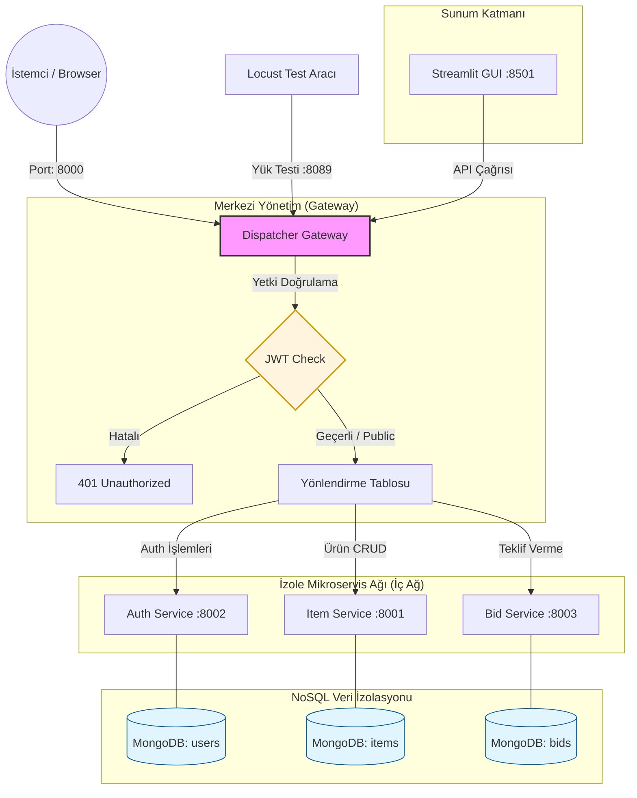

### 2.3 Ağ İzolasyonu / Network Isolation

Docker Compose yapılandırmasında yalnızca **Dispatcher (8000)**, **GUI (8501)** ve **Locust (8089)** dış dünyaya açıktır. Tüm mikroservisler (`item_service`, `auth_service`, `bid_service`) sadece iç Docker ağında çalışır; dışarıdan doğrudan erişim **mümkün değildir**.

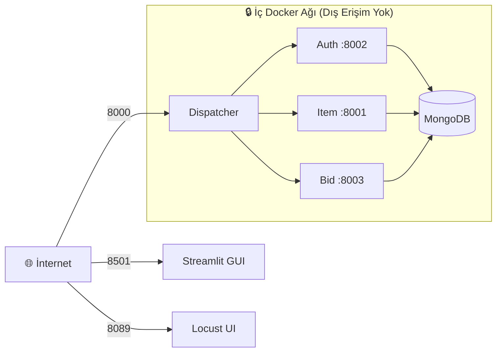

> **Not:** `docker-compose.yml` dosyasında `item_service`, `auth_service` ve `bid_service` için `ports` alanı kasıtlı olarak kaldırılmıştır. Bu sayede söz konusu servisler yalnızca `dispatcher` üzerinden erişilebilir durumdadır.

### 2.4 Richardson Olgunluk Modeli / Richardson Maturity Model (RMM)

Richardson Olgunluk Modeli, REST API'lerinin ne kadar "RESTful" olduğunu 4 seviyede ölçer.

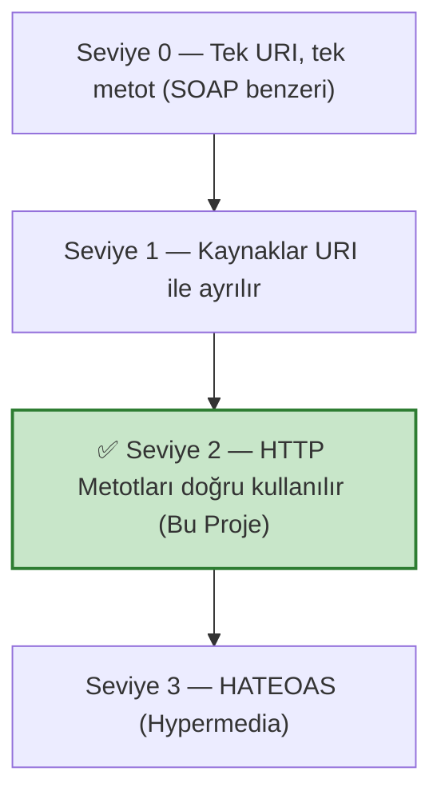

Bu projede **Seviye 2** tam olarak uygulanmıştır:

| İşlem | URI | HTTP Metodu | Başarı Kodu |
|---|---|---|---|
| Ürün listeleme | `/items` | `GET` | 200 OK |
| Ürün oluşturma | `/items` | `POST` | 201 Created |
| Ürün güncelleme | `/items/{id}` | `PUT` | 200 OK |
| Ürün silme | `/items/{id}` | `DELETE` | 204 No Content |
| Kayıt | `/register` | `POST` | 201 Created |
| Giriş | `/login` | `POST` | 200 OK |
| Teklif verme | `/bids` | `POST` | 201 Created |
| Teklifleri görme | `/bids/{item_id}` | `GET` | 200 OK |

> ❌ Yanlış kullanım örneği: `POST /deleteItem?id=1`
> ✅ Bu projede: `DELETE /items/{item_id}` → `204 No Content`

### 2.5 Sistemin Docker Mimarisi / Docker Compose Architecture

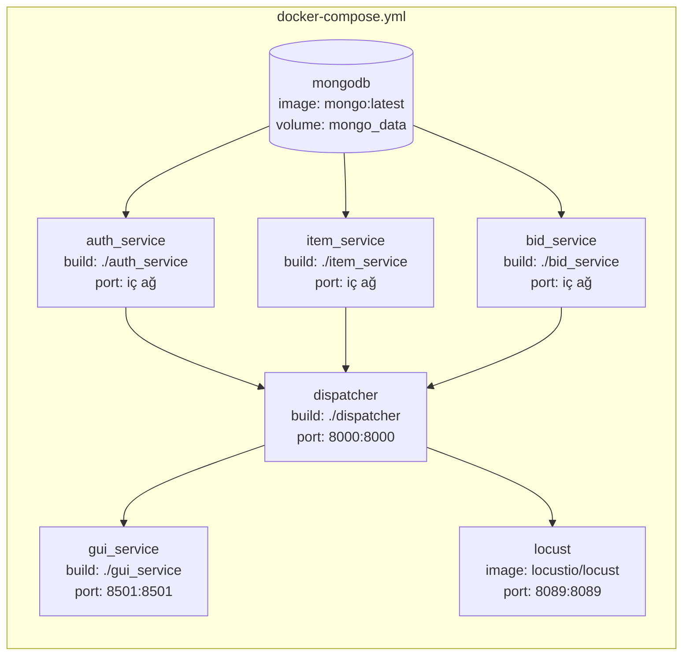

---

## 3. Servis Detayları / Service Details

### 3.1 Dispatcher (API Gateway)

Sistemin tek giriş noktasıdır. Tüm JWT doğrulama ve yönlendirme mantığı burada merkezileştirilmiştir. TDD (Red-Green-Refactor) döngüsüyle geliştirilmiştir.

**Sequence Diyagramı — Korumalı İstek Akışı:**

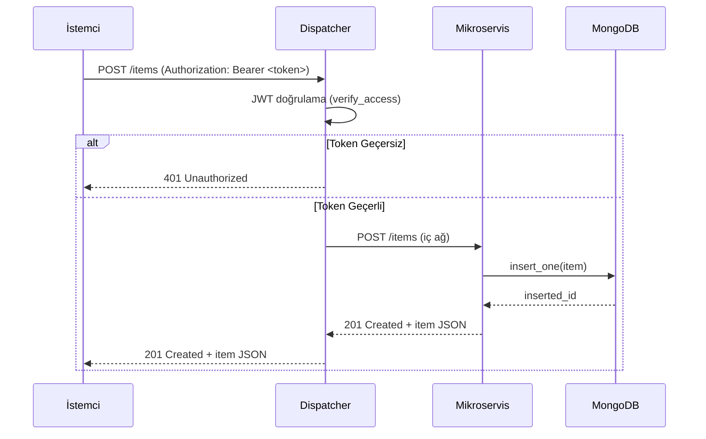

**Sequence Diyagramı — Login Akışı:**

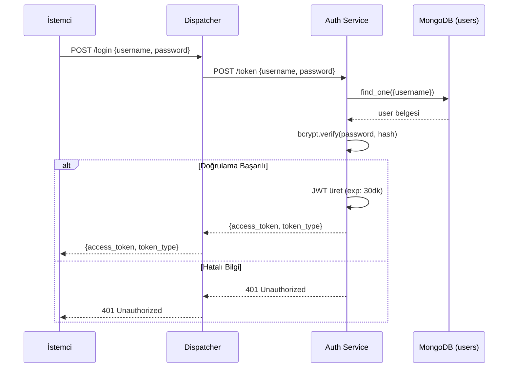

**Sınıf Yapısı / Class Structure:**

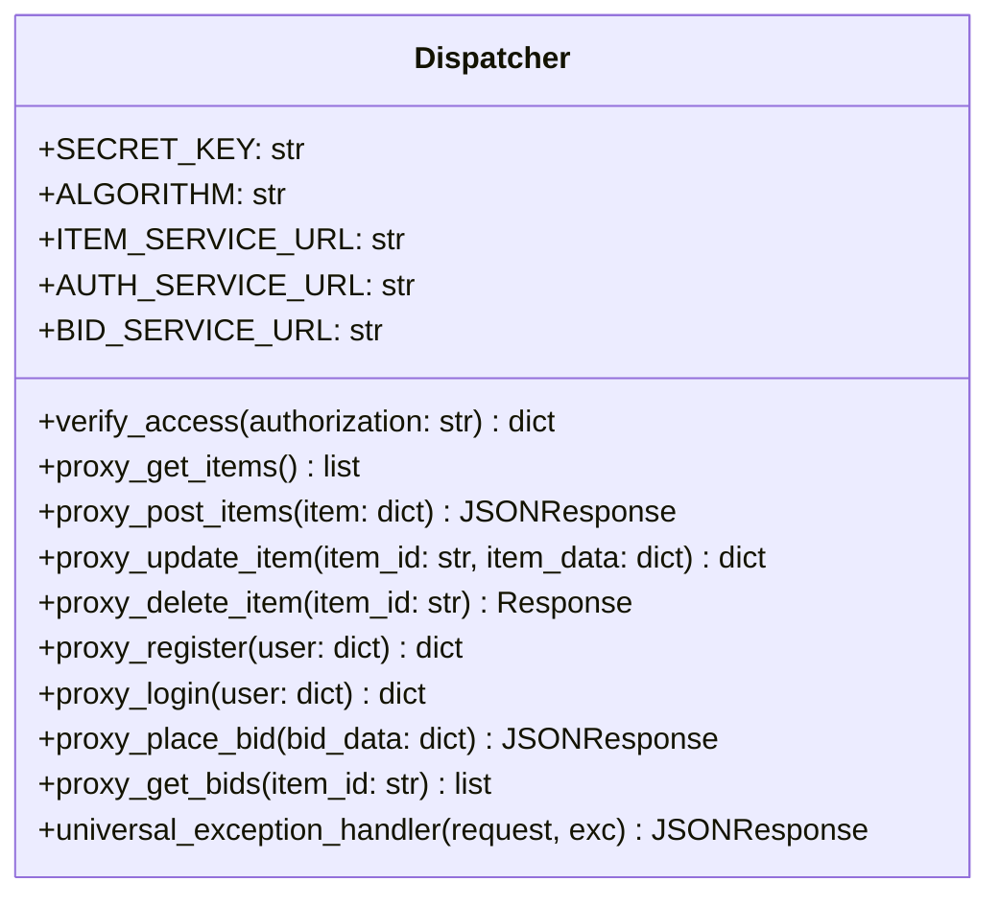

**TDD Akış Diyagramı / TDD Flow:**

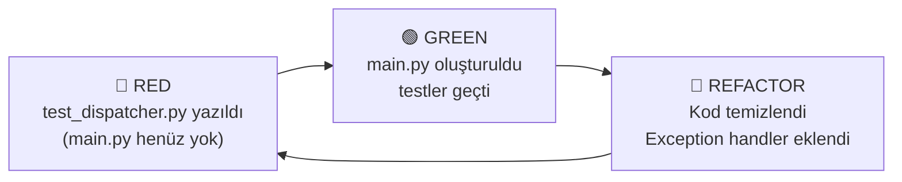

### 3.2 Auth Service

Kullanıcı kayıt ve giriş işlemlerini yönetir. Şifreler BCrypt ile hashlenir, başarılı girişte 30 dakika geçerli JWT üretilir.

**Sınıf Yapısı:**

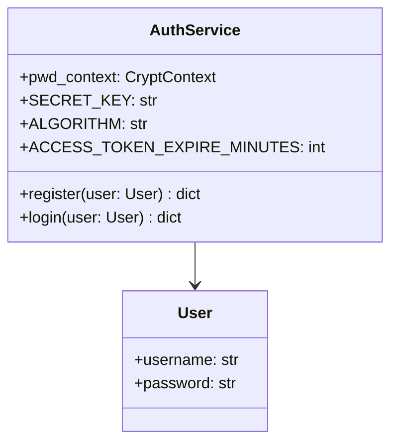

### 3.3 Item Service

Müzayede ürünlerinin CRUD işlemlerini gerçekleştirir. RMM Seviye 2 uyumludur: `PUT` ile güncelleme, `DELETE` ile silme sonrası `204 No Content` döner.

**Sınıf Yapısı:**

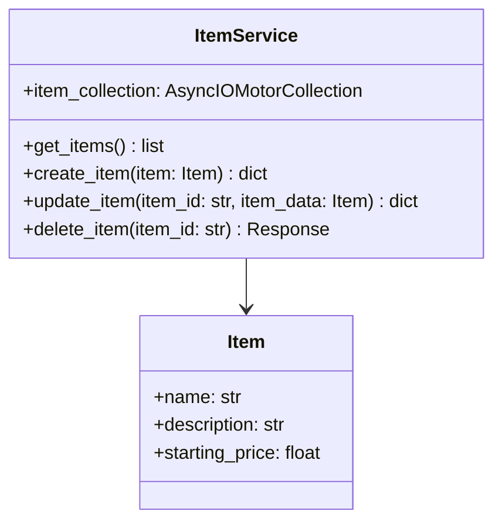

**Akış Diyagramı — Silme İşlemi:**

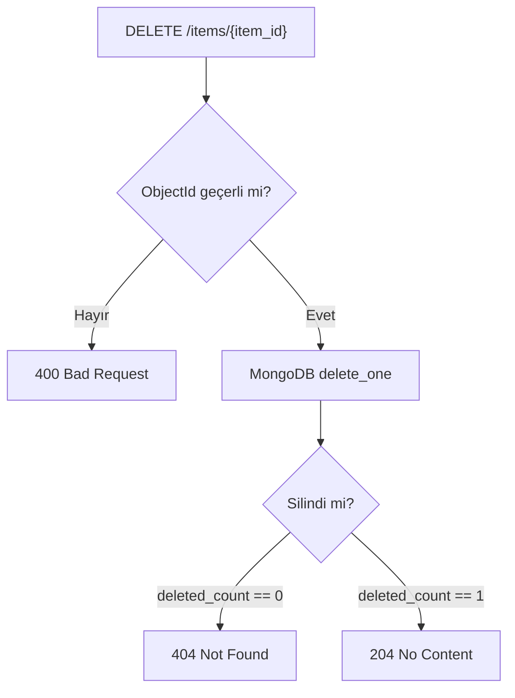

### 3.4 Bid Service

Teklif oluşturma ve sorgulama işlemlerini yönetir. `user_id` alanı Dispatcher tarafından JWT payload'ından enjekte edilir; servis doğrudan dışarıya kapalıdır.

**Sınıf Yapısı:**

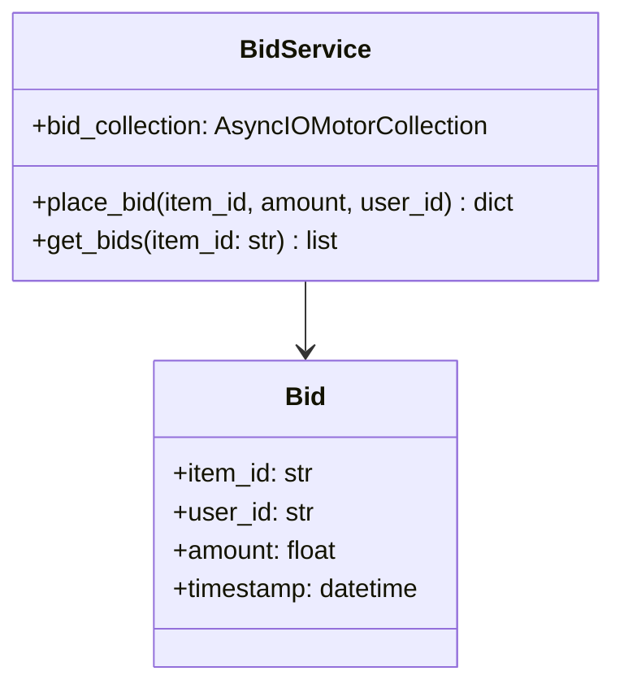

### 3.5 GUI Service (Streamlit)

Yönetim paneli üç sekme içerir: Ürün Yönetimi, Canlı İzleme ve Yük Testi. Dispatcher üzerinden tüm API çağrılarını yapar; doğrudan mikroservislere erişmez.

**Sekme Yapısı:**

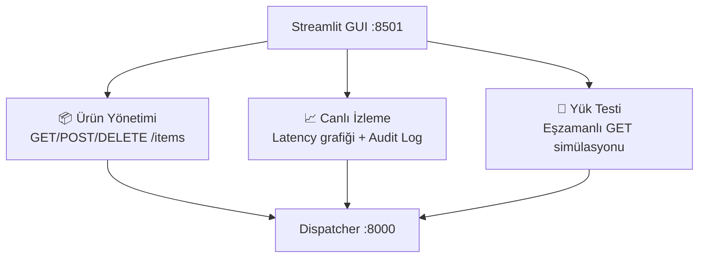

---

## 4. Yük Testleri / Load Tests

### 4.1 Locust Test Senaryosu

`locustfile.py` içinde tanımlanan `AuctionUser` sınıfı, gerçekçi bir kullanıcı davranışını simüle eder:

- `on_start`: Her sanal kullanıcı sisteme login olur ve JWT token alır.
- `@task(3) view_items`: Ağırlık 3 — ürün listeleme (okuma yoğunluklu trafik)
- `@task(1) post_bid`: Ağırlık 1 — rastgele ürüne teklif verme (yazma trafiği)

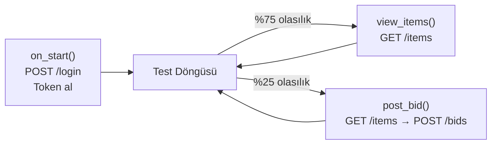

**Test Konfigürasyonu:**

| Parametre | Değer |
|---|---|
| Hedef URL | `http://dispatcher:8000` |
| Bekleme Süresi | 1–3 saniye (kullanıcı başına) |
| Locust Arayüzü | `http://localhost:8089` |
| Test Senaryoları | 50 / 100 / 200 / 500 eşzamanlı kullanıcı |

### 4.2 GUI Yük Testi (Streamlit Tab 3)

Streamlit arayüzünün 3. sekmesinde yerleşik basit bir yük testi motoru bulunmaktadır. Eşzamanlı kullanıcı sayısı (1–100) ve süre (1–30 saniye) slider ile ayarlanabilir; sonuçlar Plotly grafiğiyle anlık izlenir.

### 4.3 Test Sonuçları / Test Results

#### 🧪 50 Eşzamanlı Kullanıcı / 50 Concurrent Users


> **Gözlem:** 50 kullanıcıda sistem kararlı çalıştı. ~30 RPS değerine ulaşıldı. p50 yanıt süresi ~100ms ile oldukça düşük seyretti. p95 ise ~2500ms'ye kadar çıktı ancak hata oranı minimumdaydı. Sistem bu yük altında sağlıklı çalışmaktadır.

---

#### 🧪 100 Eşzamanlı Kullanıcı / 100 Concurrent Users


> **Gözlem:** 100 kullanıcıda RPS ~55'e yükseldi. p50 ~200ms stabil kaldı ancak p95 ~5000ms'ye ulaştı. Yük artışıyla birlikte bazı hata paketleri gözlemlendi. Dispatcher yönlendirme doğruluğunu korudu.

---

#### 🧪 200 Eşzamanlı Kullanıcı / 200 Concurrent Users


> **Gözlem:** 200 kullanıcıda p95 yanıt süresi ~6500ms'ye ulaştı. RPS ~25 seviyesinde dengelendi; sistemin bu noktada darboğaz yaşamaya başladığı gözlemlendi. Hata oranı belirgin şekilde arttı, MongoDB bağlantı havuzu baskı altına girdi.

---

#### 🧪 500 Eşzamanlı Kullanıcı / 500 Concurrent Users


> **Gözlem:** 500 kullanıcıda p95 yanıt süresi ~25.000ms'ye (25 saniye) fırladı. Yüksek hata oranı gözlemlendi. Sistem bu yük seviyesinde belirgin şekilde zorlandı. Gerçek üretim ortamında horizontal scaling (birden fazla Dispatcher instance) ve MongoDB replica set ile bu durum iyileştirilebilir.

---

### 4.4 Ölçekleme & Değerlendirme / Scaling & Evaluation

| Eşzamanlı Kullanıcı | Maks. RPS | p50 Yanıt (ms) | p95 Yanıt (ms) | Hata Durumu |
|---|---|---|---|---|
| 50 | ~30 | ~100 | ~2.500 | ✅ Minimal |
| 100 | ~55 | ~200 | ~5.000 | ⚠️ Az hata |
| 200 | ~25 | ~300 | ~6.500 | ⚠️ Belirgin hata |
| 500 | ~65 | ~400 | ~25.000 | ❌ Yüksek hata |

**Değerlendirme / Evaluation:**

Sistem 50–100 kullanıcı aralığında sağlıklı ve kararlı çalışmaktadır. 200 kullanıcıdan itibaren MongoDB bağlantı havuzu ve async istek kuyruğu darboğaz oluşturmaktadır. 500 kullanıcıda p95 yanıt süresinin 25 saniyeye çıkması, mevcut tek-instance mimarisinin üretim için yetersiz kalacağını göstermektedir. Çözüm olarak Dispatcher'ın yatay ölçeklenmesi ve MongoDB bağlantı havuzu optimizasyonu önerilmektedir.

---

## 5. Kurulum / Quick Start

### Ön Gereksinimler / Prerequisites

- Docker Desktop (v24+)
- Docker Compose (v2+)

### 🚀 Tek Komutla Başlatma / One-Command Start

```bash
git clone <repo-url>
cd b2b-studio-auction
docker-compose up --build
```

### Servis Adresleri / Service Endpoints

| Servis | URL |
|---|---|
| Dispatcher (API Gateway) | `http://localhost:8000` |
| GUI (Yönetim Paneli) | `http://localhost:8501` |
| Locust (Yük Testi) | `http://localhost:8089` |
| API Dokümantasyonu | `http://localhost:8000/docs` |

### Test Kullanıcısı Oluşturma / Create Test User

```bash
# Kullanıcı kayıt
curl -X POST http://localhost:8000/register \
  -H "Content-Type: application/json" \
  -d '{"username": "umut_test", "password": "test123"}'

# Giriş & token al
curl -X POST http://localhost:8000/login \
  -H "Content-Type: application/json" \
  -d '{"username": "umut_test", "password": "test123"}'
```

### Testleri Çalıştırma / Run Tests

```bash
# Dispatcher TDD testleri
cd dispatcher && pytest test_dispatcher.py -v

# Auth Service testleri
cd auth_service && pytest test_auth.py -v

# Item Service testleri
cd item_service && pytest test_items.py -v

# Bid Service testleri
cd bid_service && pytest test_bids.py -v
```

---

## 6. Projenin Geleceği / Future Work

### 🇹🇷 Başarılar & Sınırlılıklar

**Başarılar:**
- Tam mikroservis izolasyonu sağlandı; her servis bağımsız ölçeklenebilir.
- TDD (Red-Green-Refactor) döngüsü Dispatcher için eksiksiz uygulandı.
- RMM Seviye 2 standartları tüm endpoint'lerde karşılandı.
- Docker Compose ile tek komutla tam çalışan sistem kuruldu.
- JWT tabanlı merkezi yetkilendirme ve ağ izolasyonu hayata geçirildi.

**Sınırlılıklar:**
- Token yenileme (refresh token) mekanizması henüz implemente edilmedi.
- Servisler arasında async event-driven iletişim (Kafka/RabbitMQ) bulunmuyor.
- HTTPS/TLS desteği eklenmedi .
- Servis sağlığı için health check endpoint sayısı sınırlı.

### 🇬🇧 Achievements & Limitations

**Achievements:**
- Full microservice isolation achieved; each service is independently scalable.
- TDD (Red-Green-Refactor) cycle fully implemented for the Dispatcher.
- RMM Level 2 standards met across all endpoints.
- Single `docker-compose up` command starts the entire system.
- JWT-based centralized authorization and network isolation implemented.

**Limitations:**
- Refresh token mechanism not yet implemented.
- No async event-driven inter-service communication (Kafka/RabbitMQ).
- HTTPS/TLS support not added ).
- Limited health check endpoints per service.

### 🔮 Olası Geliştirmeler / Future Improvements

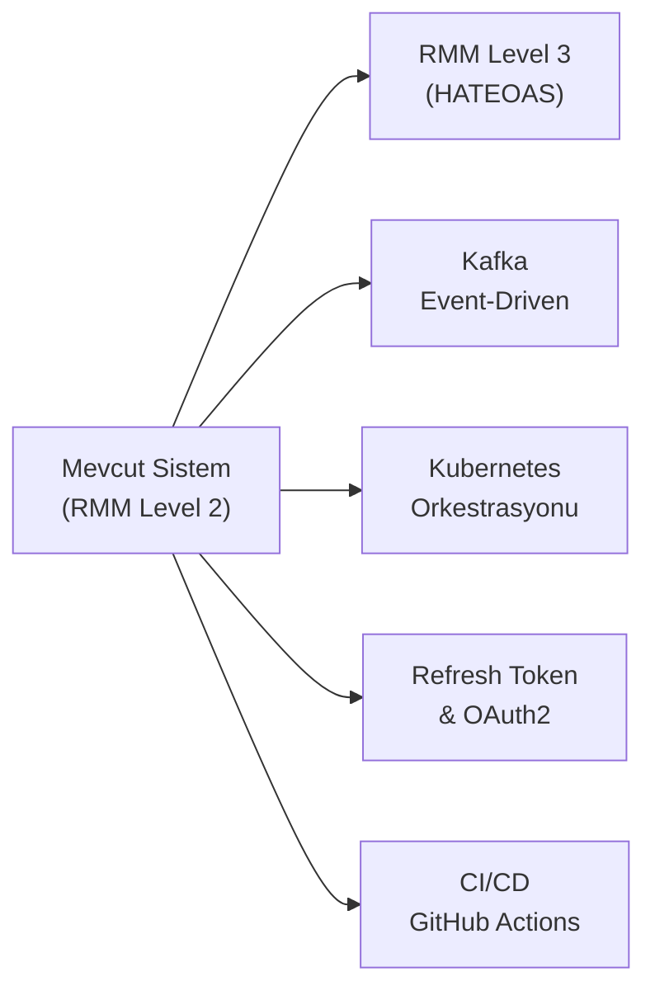

---

<div align="center">

**Bridge to Bridge Studio** — *Art meets Engineering*

*Kocaeli Üniversitesi | Bilişim Sistemleri Mühendisliği | 2025–2026*

</div>
